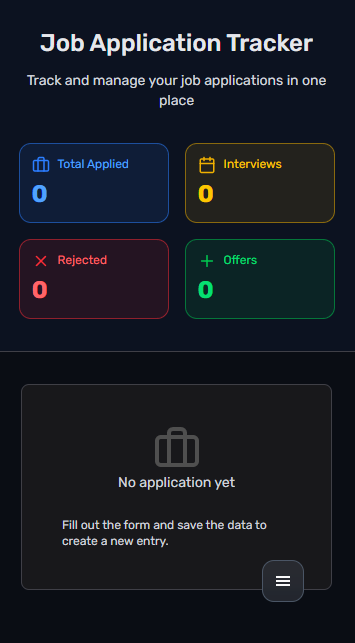
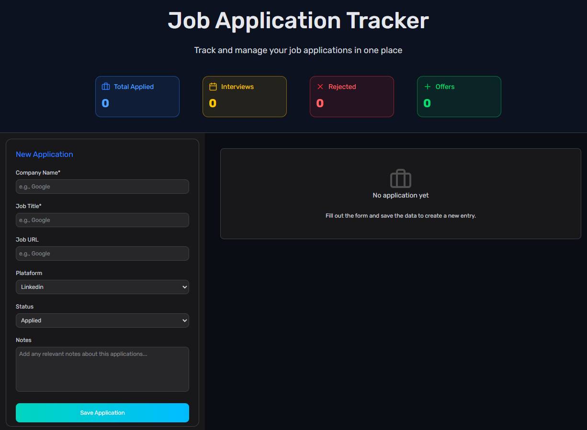

### PZ Web Developer

<a href='https://portfolio-opal-nine-21.vercel.app/'> 👉 Portfolio web 👈 </a>

# Job App — Application Tracker

 

 

<h2> 🔗 <a href='https://job-app-phi-six.vercel.app/'> Live demo </a>

## 🗒️ Descripción
**Job App** es una aplicación web diseñada para ayudar a los usuarios a **gestionar y hacer seguimiento de sus solicitudes de empleo** de forma clara, organizada y visual.  
Está pensada para centralizar toda la información relevante del proceso de búsqueda laboral, evitando el uso de hojas de cálculo o notas dispersas.

---

## 🎯 Objetivos del proyecto
- Mejorar y aplicar una **estructura de carpetas escalable**.
- Poner en práctica el **manejo de estado global con Zustand**.
- Generar formularios **seguros y correctamente estructurados**.
- Construir una **interfaz dinámica, intuitiva e interactiva**.
- Desarrollar un proyecto real orientado a **portfolio profesional**.
- Persistencia de datos.

---

## ✨ Características
- 📋 Registro de solicitudes de empleo (empresa, puesto, fecha y estado).
- 🗂 Visualización de todas las aplicaciones en un tablero centralizado.
- 🔄 Edición y actualización del estado de cada solicitud  
  _(Aplicada, Entrevista, Oferta, Rechazada, etc.)_.
- 📝 Añadir notas o comentarios personalizados por aplicación.
- 🌐 Despliegue en **Vercel** para acceso público.

---

## ⚒️ Stack Tecnológico
- **React** — Librería para la construcción de la UI.
- **TypeScript** — Tipado estático para mayor robustez.
- **Zustand** — Gestión de estado global.
- **Vite** — Entorno de desarrollo rápido y eficiente.
- **React Hook Form & Zod** — Manejo y validación de formularios.
- **Tailwind CSS** — Estilado utilitario y responsive.

 

 
👷‍♂️ Proyecto desarrollado con fines de **aprendizaje y práctica de conceptos frontend**.

 

#### 👌 ¿Te ha gustado? ¡Puedes dejar una estrella! ⭐

 

### Desarrollado con 💕 por <a href='https://portfolio-opal-nine-21.vercel.app/'>Pablo</a>
 
<a href='https://www.linkedin.com/in/pablozalliodev/'>LinkedIn</a> · 
<a href="mailto:pablozalliodev@gmail.com" target="_blank">Correo</a>

